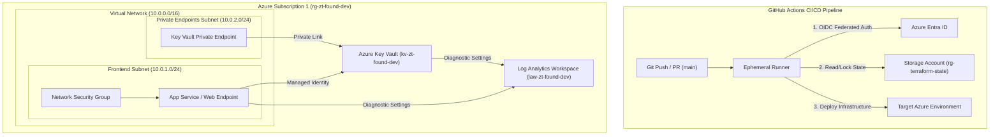
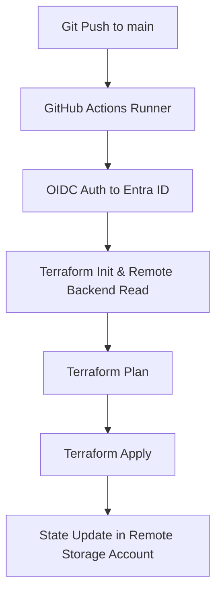

# 🛡️ Azure Cloud Security Lab: Zero Trust & Automated Infrastructure


This repository provides an enterprise-ready **Secure Landing Zone on Microsoft Azure** provisioned via **Infrastructure as Code (Terraform)**, integrated with an automated **DevSecOps CI/CD pipeline (GitHub Actions + Checkov)** enforcing strict *Shift-Left Security* and regulatory compliance.

---

## 🏗️ Architecture & Security Controls

The architecture is built upon the **Least Privilege** principle and **Zero Trust Architecture (ZTA)**, structured as follows:


## 🗝️ Key Features & Security Architecture

1. **Passwordless Authentication (OIDC):**
   * Eliminates static credentials (`AZURE_CREDENTIALS` client secrets).
   * GitHub Actions authenticates against Azure Entra ID via Federated Identity Credentials.

2. **Remote State Management:**
   * Centralized `.tfstate` stored in an isolated Storage Account (`rg-terraform-state`).
   * Configured with state locking to prevent concurrent deployment drifts.

3. **Zero Trust Principles:**
   * **Explicit Verification:** Role-Based Access Control (RBAC) enforced via Managed Identities.
   * **Least Privilege Access:** Key Vault exposed via **Private Endpoint** only, bypassing public internet exposure.
   * **Assume Breach:** All operations streaming audit metrics to **Log Analytics Workspace** (`ds-kv-to-loganalytics`).

---

## 🛠️ Tech Stack & Components

| Category | Technology |
| :--- | :--- |
| **Cloud Provider** | Microsoft Azure |
| **Infrastructure as Code** | Terraform (azurerm provider) |
| **CI/CD Orchestration** | GitHub Actions |
| **Authentication** | OIDC (OpenID Connect) + Entra ID |
| **Security Controls** | Azure Key Vault, Network Security Groups (NSG), Private Endpoints |
| **Observability** | Azure Monitor, Log Analytics Workspace |

---

## 🚀 Deployment Pipeline

The workflow runs automatically on `push` or `pull_request` to the `main` branch:


### Manual Trigger & Troubleshooting

If environment collisions or stale resources occur, clean the application group asynchronously:

```bash
az group delete --name rg-zt-found-dev --yes
```

### 👨‍💻 Author & Lessons Learned

* **Project Purpose:** Built to demonstrate real-world **Cloud Security Engineering** practices, IaC state management troubleshooting, and **CI/CD hardening**.
* **Key Engineering Takeaway:** Resolved state drifts and resource collisions caused by ephemeral GitHub runners by implementing an **OIDC-authenticated Azure remote backend**.